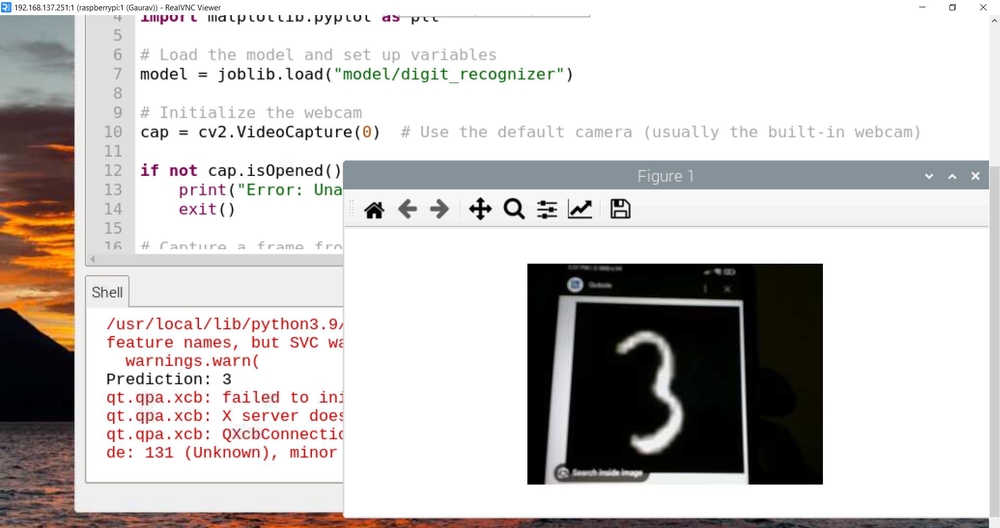
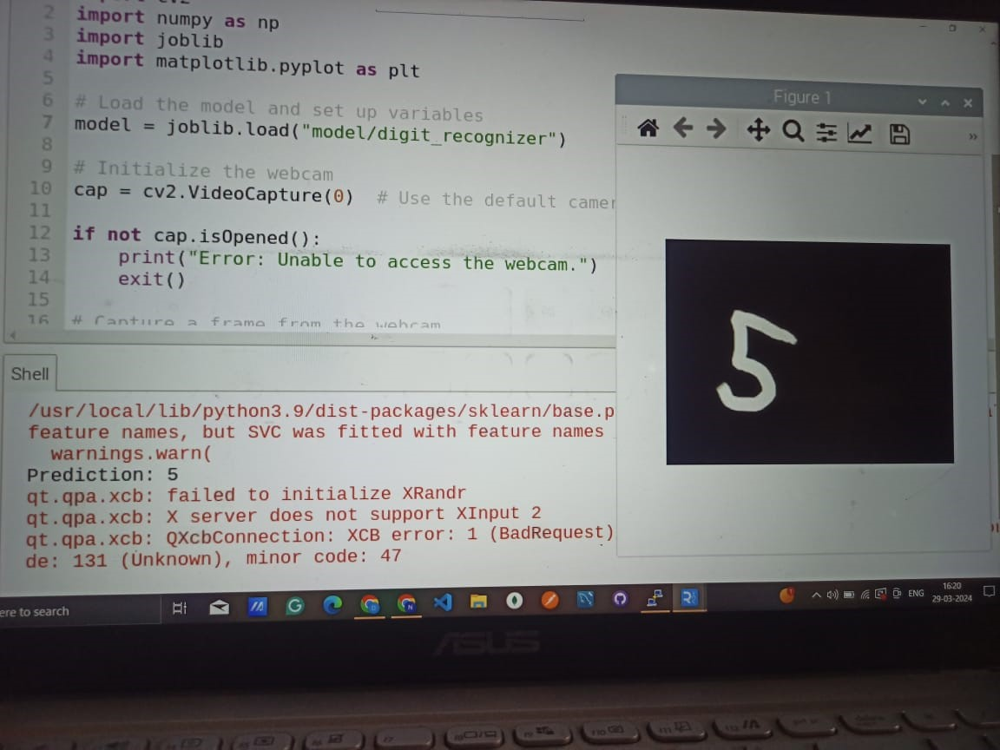
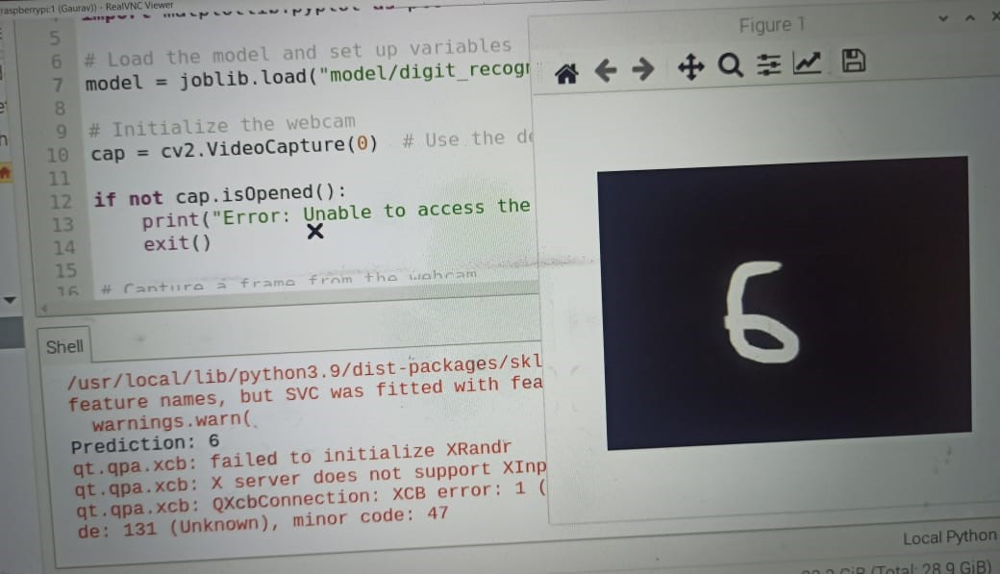
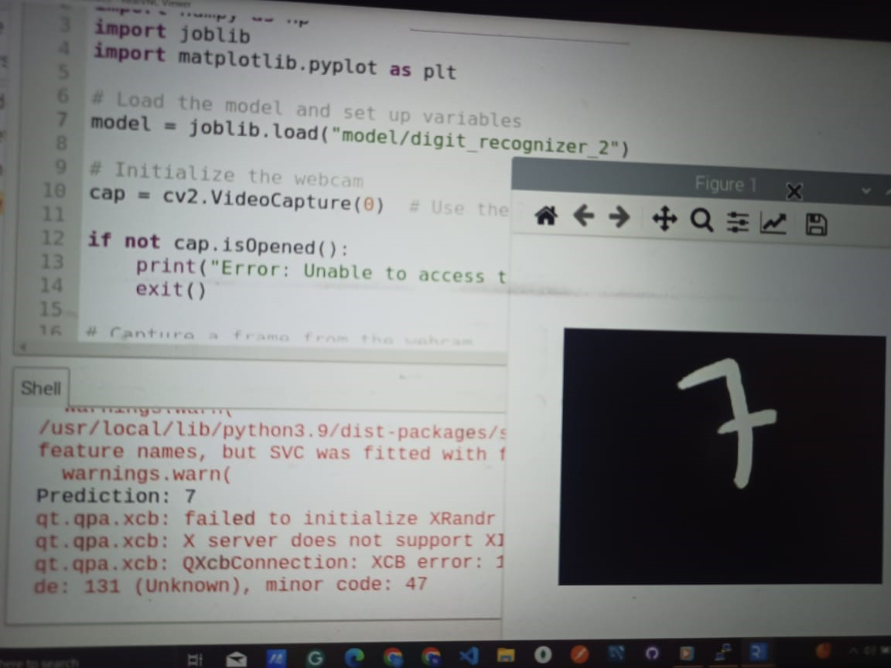

# Handwritten-Digit-Recognizer

This repository contains Python scripts for machine learning tasks implemented using Python 3.x. It includes various examples and projects that utilize popular machine learning libraries and frameworks.

## Dependencies

To run the scripts in this repository,  the following Python libraries installed:

- numpy
- scikit-learn
- opencv2
- pandas
- joblib
- matplotlib
## Description
This project delves into developing a robust Support Vector Machine (SVM) classifier tailored for handwritten digit recognition. It extensively investigates preprocessing techniques, including normalization and denoising, to refine input image quality and enhance classification accuracy. Leveraging benchmark datasets, the SVM model is trained and evaluated, showcasing its efficacy in accurately identifying handwritten digits. A thorough analysis of classification accuracy is conducted, shedding light on the SVM model's performance, strengths, and limitations. Furthermore, the report explores potential enhancements and future research avenues, aiming to bolster the classifier's performance and scalability. By addressing fundamental challenges in pattern recognition and machine learning, this study contributes to advancing the field's understanding and practical applications, such as postal automation and bank check processing, with implications for various industries reliant on automated data processing.

## Implementation

The implementation consists of the following steps:

### Data Collection and Preprocessing:

- Gather a dataset of handwritten digit images, such as the MNIST dataset.
- Preprocess the data using techniques like normalization and feature extraction with Python libraries like NumPy, pandas, and OpenCV.

### Model Training:

- Select a suitable machine learning algorithm, such as Support Vector Machines (SVM) or Random Forests.
- Train the model using preprocessed data and optimize its parameters using cross-validation.

### Model Evaluation:

- Evaluate the classifier's performance using metrics like accuracy, precision, recall, and F1-score.
- Utilize cross-validation and confusion matrices for deeper insights into the model's behavior.

### Integration with RaspberryPi3 :

- Adapt the trained model for deployment on Raspberry Pi using libraries like TensorFlow Lite or ONNX Runtime.
- Optimize the model for the Raspberry Pi's ARM architecture, considering factors like model size and computational complexity.

### Camera Configuration:

- Configure parameters of the Raspberry Pi's camera module for capturing high-quality images.
- Apply real-time image processing techniques to enhance image clarity and feature extraction.

### Display Output:

- Design a user-friendly interface to display classification results on a connected display.
- Present captured images along with predicted digits and confidence scores for improved usability.

<table>
  <tr>
    <td>
      
    </td>
    <td>
      
    </td>
  </tr>
  <tr>
    <td>
      
    </td>
    <td>
      
    </td>
  </tr>
</table>

